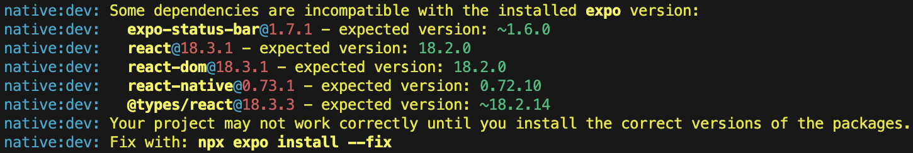

<strong>웹뷰(WebView)</strong>는 **모바일 애플리케이션에서 웹 콘텐츠를 표시**하기 위해 사용하는 구성 요소다.

## 웹뷰는 어떻게 시작됐나

- 기존 앱 시장에서 웹뷰를 사용하지 않았었는데, 모바일 기기의 성능이 좋지 않았기 때문이다.
- 좋지 않은 성능은 웹뷰 진입부터 지연을 발생시켰고 모바일 기기의 발전으로 이런 허들은 자연스럽게 사라졌다.
- 또한 JavaScript가 발전하고 SPA가 대두되면서 웹 페이지의 사용성이 좋아지고 업데이트의 유연성 다양한 플랫폼에서의 활용 가능성이 장점으로 부각되어 많이 활용되고 있다.

## 웹뷰의 장단점

장점만 있을 것 같은 웹뷰도 단점은 있다 장단점을 알아보자.

### 장점

- 크로스 플랫폼 호환성: iOS나 Android 등 여러 플랫폼에서 동일한 웹 어플리케이션을 실행할 수 있으며, 이를 통해 개발 비용과 시간을 절약할 수 있다.
- 업데이트 유연성: 앱스토어 승인을 거치지 않아도 되기에, 앱 자체를 업데이트 하는 것보다 업데이트가 유연하며 빠르다.
- 개발 속도 향상: 웹 개발과 앱 개발을 동시에 진행할 수 있어 빠른 개발을 진행할 수 있다.

### 단점

- 비교적 느림: 네이티브 앱에 비해 비교적 로딩 시간이 느리다. 앱은 스토어에서 빌드가 완료되지만 웹뷰는 리소스를 다운로드하고 보여주는데 시간이 필요하다.
- 제한된 네이티브 기능: 네이티브 앱에서 활용하는 모든 기능을 활용하지 못한다. 특정 네이티브 API에 접근하기 위해 추가적인 작업이 필요할 수 있다.
- 스토어 심사가 어려울 수 있음: 웹뷰로만 이루어진 앱은 스토어 심사가 어려울 수 있다. 자세한 내용은 Google의 [WebView 및 제휴사 스팸 정책](https://support.google.com/googleplay/android-developer/answer/9899034?hl=ko), Apple의 [Minimum Functionality 정책](https://developer.apple.com/app-store/review/guidelines/#minimum-functionality)을 확인하자.

## 웹뷰는 어떻게 구현되나

앞서 말했듯이 웹뷰는 네이티브 앱에 웹 브라우저 형태로 콘텐츠를 보여준다. 어떤 방식으로 구현되는지 예제를 통해 확인해보자.

### 디버깅 로그

웹뷰 테스트 구현을 진행하면서 문제 해결한 내용이다. 결과적으로 `react-native` 를 사용하지 않고 Flutter를 사용했다.

#### pnpm `react-native` 템플릿

> [!NOTE]
> 원문은 [`turbo` 레포지토리 이슈](https://github.com/vercel/turbo/issues/7747) 참고

패키지 관리자를 `yarn` 으로 변경하면 해결이 된다. 추가로 아래 디버깅 로그를 확인하면 의존성 문제와 관련된 내용이 있는데 이것도 그 문제였는데 오류가 제대로 반환되지 않은 것 같기도 하다.

#### `expo` 버전에 맞지 않는 의존성 버전 문제

`yarn` 기반으로 프로젝트를 생성하고 `yarn dev` 를 통해 일괄 실행하면 다음 오류를 뿜어낸다.



설치된 `expo` 버전과 의존성들의 버전이 올바르지 않다는 오류다. `expo` 버전에 맞도록 의존성을 수정하면 된다.

```sh
# natvie 디렉토리로 이동
cd ./apps/native

# 올바른 의존성 버전 업데이트
npx expo install --fix

# 다시 루트로 디렉토리 이동하고 패키지 재설치
cd ../../
yarn install
```

#### `expo-web` 의 `react-native-webview` 지원 중단

> 참고: [Stackoverflow](https://stackoverflow.com/questions/60592332/reactnative-webview-not-rendering-on-web-but-works-fine-on-android)

템플릿으로 시작한 프로젝트는 기본적으로 `expo-web` 을 통해 실행되는데 이젠 `react-native-webview` 를 지원하지 않는다고 한다.

이를 `<iframe>` 으로 분기하여 보여줄 수는 있지만 웹뷰를 활용해야 하기 때문에 다른 방식을 찾아보자.

### 참고

- [Toss payment 개발자 센터 : 웹뷰(WebView)](https://docs.tosspayments.com/resources/glossary/webview)
- [모바일 웹뷰를 탐험하는 개발자를 위한 안내서 (상)](https://vallista.kr/%EB%AA%A8%EB%B0%94%EC%9D%BC-%EC%9B%B9%EB%B7%B0%EB%A5%BC-%ED%83%90%ED%97%98%ED%95%98%EB%8A%94-%EA%B0%9C%EB%B0%9C%EC%9E%90%EB%A5%BC-%EC%9C%84%ED%95%9C-%EC%95%88%EB%82%B4%EC%84%9C-%EC%83%81/)
